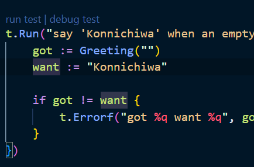

# Run Go

Ini langkah-langkah ngebuat project `Go`.

- Buat dir baru
- Buka terminal lalu ketik `go mod init [nama module]`
- `go mod tidy`
- Buat file go
- Run dengan cara `go run namafile.go`

Dari _go mod init_ bakal terbentuk file `go.mod` yang isinya kayak gini

```
module gitgithub

go 1.23.4
```

## Import another package

Ini kayak proses `npm install`. 
Nah sekarang kita bakal coba install package `rsc.io/quote` . Caranya

```
go get rsc.io/quote
```

Nah nanti `go.mod` bakal berubah isinya jadi kek gini

```
module gitgithub

go 1.23.4

require (
	golang.org/x/text v0.0.0-20170915032832-14c0d48ead0c // indirect
	rsc.io/quote v1.5.2 // indirect
	rsc.io/sampler v1.3.0 // indirect
)
```

Terus ubah `hello.go` jadi kayak gini
```
package main

import (
	"fmt"
	"rsc.io/quote"
)

func main() {
	fmt.Println("Konnichiwa")
	fmt.Println(quote.Go())
}
```

## Test

Coba test apakah benar `formatter (fmt)` akan mengembalikan `Konnichiwa`.

Gimana caranya? Kita pake prinsip `Separation of Concern (SoC)`. 

Jadi ya, pas kita ngeprint "Konnichiwa" kita tuh pasti input string kan. Nah proses input string ini tuh bagian dari `domain`, yaitu bagian yang berhubungan langsung dengan logika bisnis. Dimana-nya yang berhubungan dengan logika bisnis? Ya proses input data (string) itu sendiri.

Sedangkan, pas kita print ke layar user itu masuknya ke `side effect`. Side effect ini bisa disebut sebagai efek samping yang terjadi di luar dari domain logika. Contohnya kayak proses `display data` ke layar user, `save data to database`, dan `send http request`.

Nah di kasus ini, kita bakal misahin bagian `Greeting` jadi fungsi tersendiri supaya ada `separation of concern`-nya.

```
func Greeting() string {
    return "Konnichiwa"
}

func main() {
    fmt.Println(Greeting())
}
```

Terus buat file test bernama `hello_test.go`

```
package main

import "testing"

func TestGreeting(t *testing.T) {
	got := Greeting()
	want := "Konnichiwa"

	if got != want {
		t.Errorf("got %q want %q", got, want)
	}
}
```

Lalu run test

```
go test
```

Nanti hasilnya kayak gini. Kolom kedua itu nama module-nya btw

```
PASS
ok      example.com/hello       0
```

## Test Fail Example

Kita bakal buat 2 test. 
```
package main

import "testing"

func TestGreeting(t *testing.T) {
	t.Run("saying hello to other people", func(t *testing.T) {
		got := Greeting("Yuta-kun")
		want := "Konnichiwa Yuta-kun"

		if got != want {
			t.Errorf("got %q want %q", got, want)
		}
	})

	t.Run("say 'Konnichiwa' when an empty string is supplied", func(t *testing.T) {
		got := Greeting("")
		want := "Konnichiwa"

		if got != want {
			t.Errorf("got %q want %q", got, want)
		}
	})
}
```

Untuk buat banyak test dalam 1 file, kita bisa pake extension function `Run` (gak tau namanya di Go apa, tapi di Kotlin nama fungsi kek gini tu extension function). Parameter-nya itu ada 2, yang pertama `String` untuk ngespesifikasiin apa yang ditest. Seddangkan parameter keduanya itu `anon function untuk test`.

Nah test yang pertama itu bakal ngetest apakah bener program bakal return _"Konnichiwa Yuta-kun"_ pas kita panggil fungsi `Greeting("Yuta-kun")`. 

Run test dengan cara tekan tombol `Run test` kayak yang ada di gambar ini



Hasil test-nya

```
ok  	example.com/hello	0.193s
```


Test yang kedua, kita bakal cek apakah program bakal ngereturn _"Konnichiwa" _ pas kita panggil function `Greeting("")`. Hasil test-nya:

```
--- FAIL: TestGreeting (0.00s)
    --- FAIL: TestGreeting/say_'Konnichiwa'_when_an_empty_string_is_supplied (0.00s)
        c:\Users\Keysha\Documents\Go\hello_test.go:20: got "Konnichiwa " want "Konnichiwa"
FAIL
FAIL	example.com/hello	0.199s
FAIL
```

Udah jelas ya, error-nya:
==got "Konnichiwa " want "Konnichiwa"==

Ini karena di func `Greeting` emang ditambah spasi sebelum `name`.

```
func Greeting(name string) string {
	return helloInJapanese + " " + name
}
```

Nah sekarang coba perbaiki fungsi tersebut jadi gini

```
func Greeting(name string) string {
	if name == "" {
		return helloInJapanese
	}

	return helloInJapanese + " " + name
}
```

Udah deh, hasil test-nya `ok`

```
Running tool: C:\Program Files\Go\bin\go.exe test -timeout 30s -run ^TestGreeting$/^say_'Konnichiwa'_when_an_empty_string_is_supplied$ example.com/hello

ok  	example.com/hello	0.216s
```

Jangan merasa gimana-gimana kalo test-nya `fail`. Tujuan test kan emang buat ngecek apakah program hasil outputnya udah sesuai dengan yang diinginkan. Jadi jangan kesel sama test dan biasainlah test program yang dibangun.


## Refactor Our Test

_Maksud?_

Maksud `refactor our test` tu kek misahin hal-hal yang berulang jadi satu function. Contoh, coba liat file test kita baik-baik

```
package main

import "testing"

func TestGreeting(t *testing.T) {
	t.Run("saying hello to other people", func(t *testing.T) {
		got := Greeting("Yuta-kun")
		want := "Konnichiwa Yuta-kun"

		if got != want {
			t.Errorf("got %q want %q", got, want)
		}
	})

	t.Run("say 'Konnichiwa' when an empty string is supplied", func(t *testing.T) {
		got := Greeting("")
		want := "Konnichiwa"

		if got != want {
			t.Errorf("got %q want %q", got, want)
		}
	})
}
```

Perhatiin kode ini
```
if got != want {
    t.Errorf("got %q want %q", got, want)
}
```

Kode di atas tuh muncul berulang kali cuy. 
Bisa dijadiin satu function kan?

```
funct assertCorrectMessage(t testing.TB, got, want string) {
    t.Helper()
    if got != want {
        t.Errorf("got %q want %q", got, want)
    }
}
```

Sehingga kode lengkap `hello_test.go` jadi kayak gini
```
package main

import "testing"

func TestGreeting(t *testing.T) {
	t.Run("saying hello to other people", func(t *testing.T) {
		got := Greeting("Yuta-kun")
		want := "Konnichiwa Yuta-kun"

		assertCorrectMessage(t, got, want)
	})

	t.Run("say 'Konnichiwa' when an empty string is supplied", func(t *testing.T) {
		got := Greeting("")
		want := "Konnichiwa"

		assertCorrectMessage(t, got, want)
	})
}

func assertCorrectMessage(t testing.TB, got, want string) {
	t.Helper()
	if got != want {
		t.Errorf("got %q want %q", got, want)
	}
}
```

## Discipline

Saat ngebuat project, ada _cycle_ yang harus diikuti

- Buat test
- Implementasi kode secara minimal
- Run test
- Refactor


## Tambah bahasa


Jadi kita tambah greeting pake `spanish` dan `french`.
Ngikutin cycle project di atas, kita bakal coba buat test-nya dulu untuk kedua bahasa tersebut.

```
package main

import "testing"

func TestGreeting(t *testing.T) {
	t.Run("greet user in japanese", func(t *testing.T) {
		got := Greeting("Yuta-kun", "")
		want := "Konnichiwa Yuta-kun"

		assertCorrectMessage(t, got, want)
	})

	t.Run("greet user in spanish", func(t *testing.T) {
		got := Greeting("Yuta-kun", "spanish")
		want := "Hola Yuta-kun"

		assertCorrectMessage(t, got, want)
	})

	t.Run("greet user in french", func(t *testing.T) {
		got := Greeting("Yuta-kun", "french")
		want := "Bonjour Yuta-kun"

		assertCorrectMessage(t, got, want)
	})

	t.Run("say 'Konnichiwa' when an empty string is supplied", func(t *testing.T) {
		got := Greeting("", "")
		want := "Konnichiwa"

		assertCorrectMessage(t, got, want)
	})
}

func assertCorrectMessage(t testing.TB, got, want string) {
	t.Helper()
	if got != want {
		t.Errorf("got %q want %q", got, want)
	}
}
```

Terus revisi kode di `hello.go` jadi kayak gini

```
package main

import (
	"fmt"
)

const (
	spanish = "spanish"
	french  = "french"

	hello          = "Konnichiwa"
	helloInSpanish = "Hola"
	helloInFrench  = "Bonjour"
)

func Greeting(name string, language string) string {
	if name == "" {
		return hello
	}

	switch language {
	case spanish:
		return helloInSpanish + " " + name
	case french:
		return helloInFrench + " " + name
	}

	return hello + " " + name
}

func main() {
	fmt.Println(Greeting("Yuta-kun", ""))
	fmt.Println(Greeting("Yuta-kun", spanish))
	fmt.Println(Greeting("Yuta-kun", french))
}
```


Pas di-test hasilnya sudah `ok`.


## Refactor Again

Yang namanya ngoding pasti bakal banyak `refactor`. Jadi jangan bosen buat nge-refactor kode kamu.

Kita bisa ngerapihin kodenya supaya proses `switch` pada greeting prefix-nya bisa jadi satu function bernama `greetingPrefix`

```
func greetingPrefix(language string) (prefix string) {
	switch language {
	case spanish:
		prefix = helloInSpanish
	case french:
		prefix = helloInFrench
	default:
		prefix = hello
	}

	return
}
```

Btw kita juga bisa ngasih nama pada `return value`. 
Kayak contoh di atas, kita kasih nama return value-nya jadi `prefix`.

Nah abis itu tinggal sesuain function `Greeting`-nya

```
func Greeting(name string, language string) string {
	if name == "" {
		return hello
	}

	return greetingPrefix(language) + " " + name
}
```

Jadi lebih rapih dan _readable_ kan?


## Wrapping up

Nah kalo dilihat dari perjalanan yang udah dilalui keliatan kan ya kalo yang kita kembangin tuh `Test Driven Development`.
Ini juga yang sebenernya disaranin sama dokumentasi go.

Secara keseluruhan prosesnya itu:
- Buat test
- Implementasi kode secara minimal
- Refactor